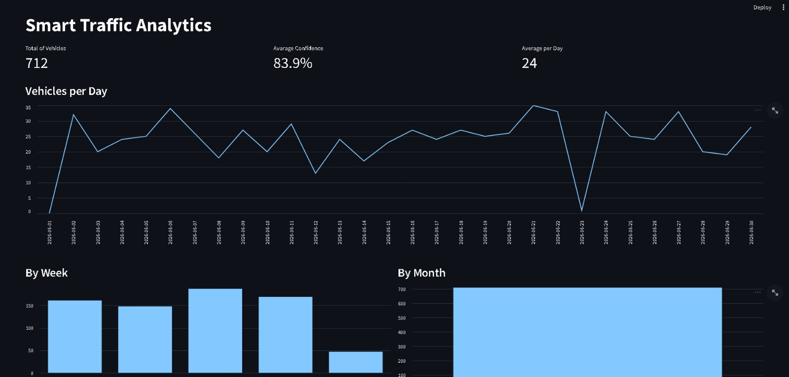

# Overview

Real-time automatic vehicle license plate recognition system, using YOLOv10, ByteTrack, and PaddleOCR in a modular setup, checking Brazilian Mercosur standards, and storing data in Oracle Database via Docker.

# Demonstration

### Detection


### Dashboard


### Dashboard - one month of monitoring



# Technologies

- YOLO
- Python
- OpenCV
- ByteTrack
- JSON
- Docker
- Oracle DataBase
- PaddleOCR
- Torch
- OpenAI
- Streamlit
- OpenRouter

# Installation

## Clone the repository

```bash
git clone git@github.com:Matheus-Sounier/Automatic-Number-Plate-Recognition.git
cd Automatic-Number-Plate-Recognition
```

## Create a virtual environment

### Linux

```bash
python3 -m venv .venv
source .venv/bin/activate
```

### Windows

```powershell
python -m venv .venv
.venv\Scripts\activate
```

## Install dependencies

```bash
pip install -r requirements.txt
```

# Oracle Database Setup

## Create the user

```sql
CREATE USER license_plate_example IDENTIFIED BY your_password;

GRANT CONNECT, RESOURCE TO license_plate_example;
```

## Configure the connection

```env
DB_USER=license_plate_example
DB_PASSWORD=your_password
DB_HOST=your_type_host
DB_PORT=1521
DB_SERVICE=your_service
```

## Run the code

If everything's all right, then run in the root directory:

```bash
python main.py

```

# How to train your own license plate yolo model

Access the roboflow and try to install any [dataset](https://universe.roboflow.com/roboflow-universe-projects/license-plate-recognition-rxg4e/dataset/4) you want 

## The dataset structure that you've installed'll look like this:

```text
dataset/
├── train/
│   ├── images/
│   └── labels/
├── valid/
│   ├── images/
│   └── labels/
└── data.yaml
```

## Example data.yaml

```yaml
path: dataset

train: train/images
val: valid/images

names:
  0: license_plate
```

## Start training

```python
from ultralytics import YOLO

model = YOLO("which_yolo_version_you_want.pt")

results = model.train(
    data="dataset/data.yaml",
    epochs=25,
    imgsz=640,
    batch=16,
    project="license_plate",
    name="training"
)
```

## Command line training

```bash
yolo detect train \
    model=which_yolo_version_you_want.pt \
    data=dataset/data.yaml \
    epochs=25 \
    imgsz=640
```

# Resume Training

## Resume from the last checkpoint

```python
from ultralytics import YOLO

model = YOLO(
    "runs/detect/license_plate_training/weights/last.pt"
)

results = model.train(
    resume=True
)
```

## Continue training with more epochs

```python
from ultralytics import YOLO

model = YOLO(
    "runs/detect/license_plate_training/weights/best.pt"
)

results = model.train(
    data="dataset/data.yaml",
    epochs=100,
    project="license_plate",
    name="license_plate_100epochs"
)
```

# Notes About The Model

- The model was trained to detect Mercosur license plates.
- Detection performance depends on image quality, lighting conditions, and camera distance.
- Higher epochs do not always result in better performance.
- Monitor mAP50-95 and validation losses to identify overfitting.
- Use `best.pt` for inference whenever possible.

# Common Issues

## Model file not found

```text
FileNotFoundError:
No such file or directory
```

Verify that the model path is correct.

```bash
ls runs/detect/
```

## CUDA not available

```text
Torch not compiled with CUDA enabled
```

Check GPU support.

```python
import torch

print(torch.cuda.is_available())
```

## Oracle connection failed

```text
ORA-12514
ORA-12154
```

Verify:

- Host
- Port
- Service name
- Username
- Password

## Low FPS during video processing

Possible causes:

- High-resolution video
- Large YOLO model
- OCR processing overhead
- CPU inference instead of GPU inference
